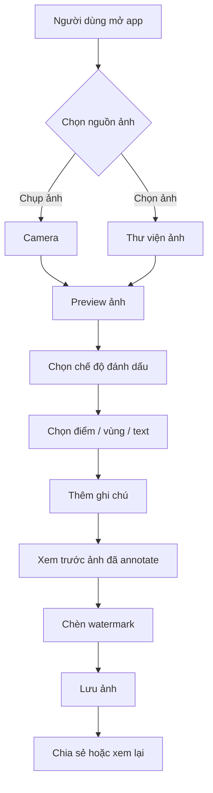
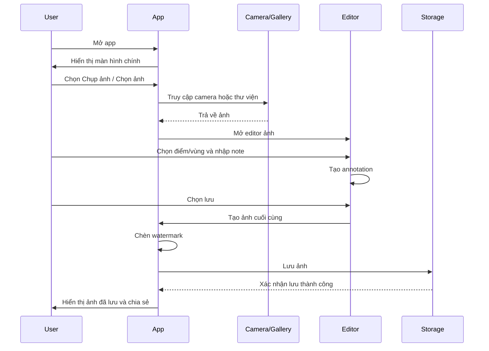
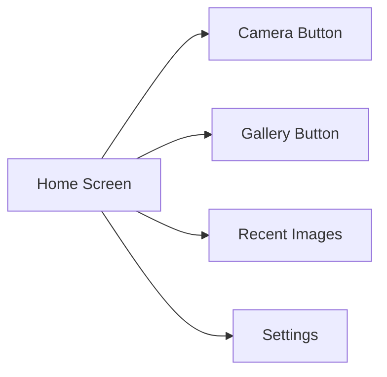
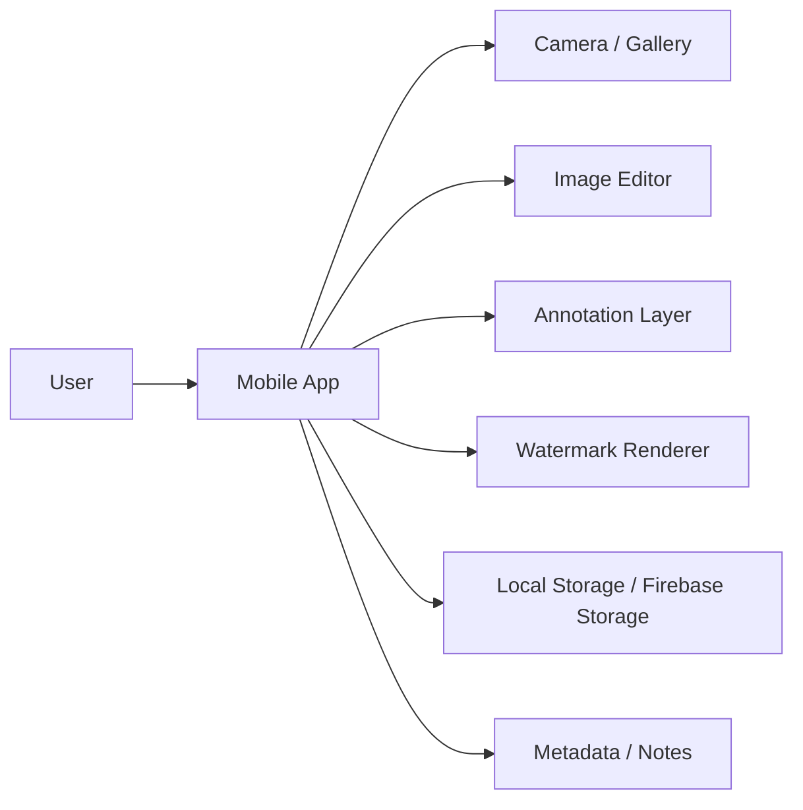
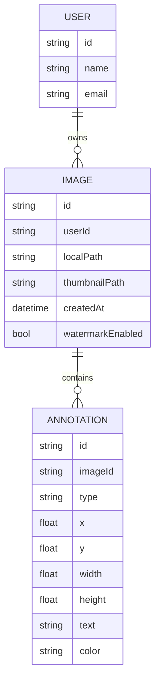
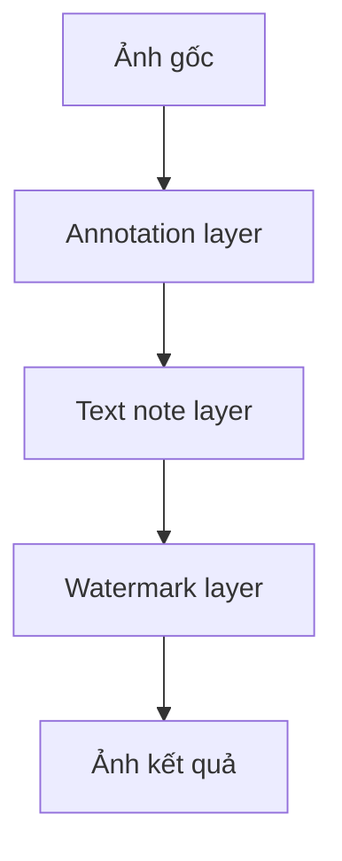
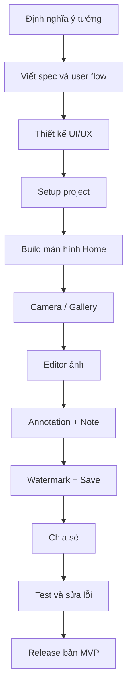

# Blueprint phát triển app chụp ảnh + ghi chú nhanh trên ảnh

## 1. Mục tiêu sản phẩm

Ứng dụng cho phép người dùng:
- chụp ảnh hoặc chọn ảnh từ thư viện
- chọn vùng/vật thể trên ảnh
- thêm ghi chú nhanh ngay trên ảnh
- lưu ảnh đã có note
- chèn watermark của app
- chia sẻ ảnh kết quả

Mục tiêu cốt lõi là giảm số bước cần thiết để từ “chụp ảnh” thành “ảnh có chú thích sẵn để dùng ngay”.

---

## 2. Vấn đề cần giải quyết

Hiện nay, người dùng thường phải:
1. chụp ảnh
2. mở app chỉnh sửa ảnh
3. vẽ/đánh dấu
4. thêm text
5. lưu ảnh
6. gửi cho người khác

Quá trình này dài và rời rạc. App này giúp hợp nhất toàn bộ quy trình vào một luồng đơn giản và nhanh.

---

## 3. Luồng người dùng từ đầu đến cuối



---

## 4. Luồng chức năng chi tiết



---

## 5. Các màn hình chính của app

### 5.1 Màn hình Home
- nút Chụp ảnh
- nút Chọn ảnh từ thư viện
- danh sách ảnh gần đây
- nút cài đặt



### 5.2 Màn hình Camera
- preview camera
- nút chụp
- đổi camera trước/sau
- flash
- hủy

### 5.3 Màn hình Editor
- ảnh đang chỉnh sửa
- toolbar: điểm, khung, text
- layer annotation
- nút lưu
- nút watermark

### 5.4 Màn hình Preview / Save
- xem trước ảnh sau khi chỉnh
- nút lưu ảnh
- nút chia sẻ
- nút quay lại chỉnh sửa

---

## 6. Tính năng cốt lõi của MVP

### 6.1 Chụp ảnh / chọn ảnh
- dùng camera nội bộ
- chọn ảnh từ thư viện
- hỗ trợ ảnh JPEG/PNG

### 6.2 Thêm annotation
- điểm đánh dấu
- khung chữ nhật
- note text ngắn

### 6.3 Chỉnh sửa note
- sửa nội dung note
- xóa note
- thay đổi màu

### 6.4 Watermark
- thêm logo/tên app
- đặt ở góc ảnh
- có thể bật/tắt

### 6.5 Lưu và chia sẻ
- lưu vào thư viện thiết bị
- chia sẻ qua ứng dụng khác

---

## 7. Kiến trúc hệ thống



### 7.1 Lớp UI
- HomeScreen
- CameraScreen
- EditorScreen
- PreviewScreen
- SettingsScreen

### 7.2 Lớp nghiệp vụ
- CaptureImageUseCase
- PickImageUseCase
- AddAnnotationUseCase
- SaveImageUseCase
- ShareImageUseCase

### 7.3 Lớp dữ liệu
- ImageRepository
- AnnotationRepository
- SettingsRepository

---

## 8. Kiến trúc dữ liệu



---

## 9. Mô hình xử lý ảnh

### 9.1 Quá trình render ảnh cuối cùng



### 9.2 Cách lưu annotation
- lưu tọa độ theo tỷ lệ ảnh gốc
- khi render lại, convert sang kích thước hiện tại
- giúp annotation không bị lệch khi zoom hoặc resize

---

## 10. Công nghệ đề xuất cho MVP

### Frontend mobile
- Flutter
- Dart
- Riverpod hoặc Bloc

### Camera và ảnh
- camera
- image_picker
- image
- path_provider
- share_plus

### Backend nhẹ (nếu cần)
- Firebase Auth
- Firestore
- Firebase Storage
- Cloud Functions (tùy chọn)

### Design
- Figma
- Design system cơ bản: màu, typography, spacing

---

## 11. Cấu trúc thư mục gợi ý

```text
lib/
  core/
    constants/
    theme/
    utils/
  features/
    home/
      presentation/
      domain/
      data/
    camera/
      presentation/
      domain/
      data/
    editor/
      presentation/
      domain/
      data/
    save/
      presentation/
      domain/
      data/
  shared/
    widgets/
    models/
    services/
```

---

## 12. Quy trình phát triển từ đầu đến app hoàn chỉnh



---

## 13. Lộ trình phát triển từng bước

### Giai đoạn 1 - Khởi tạo dự án
- tạo project Flutter
- setup Firebase
- tạo cấu trúc thư mục
- tạo theme cơ bản

### Giai đoạn 2 - Màn hình chính và camera
- home screen
- camera access
- gallery access
- preview ảnh

### Giai đoạn 3 - Editor ảnh
- hiển thị ảnh
- zoom / pan
- tool: point, rectangle, text

### Giai đoạn 4 - Annotation và lưu
- thêm note
- sửa/xóa note
- render ảnh kết quả

### Giai đoạn 5 - Watermark và share
- chèn watermark
- lưu ảnh vào thư viện
- share ảnh

### Giai đoạn 6 - Test và release
- test trên iOS/Android
- sửa lỗi UX
- release bản beta

---

## 14. MVP Definition of Done

App được xem là MVP khi người dùng có thể:
- mở app
- chụp ảnh hoặc chọn ảnh
- đánh dấu điểm/vùng
- nhập note
- lưu ảnh có watermark
- chia sẻ ảnh

---

## 15. Các rủi ro cần tránh

- annotation bị lệch khi zoom
- xử lý ảnh chậm
- watermark che mất nội dung chính
- UI quá phức tạp

Giải pháp:
- lưu annotation theo tỷ lệ ảnh gốc
- resize ảnh trước khi render
- dùng watermark nhẹ và đặt góc
- giữ toolbar tối giản

---

## 16. Kết luận

Đây là blueprint cho một app MVP tập trung vào giá trị cốt lõi:
- chụp ảnh
- đánh dấu vị trí
- thêm note
- lưu và chia sẻ

Nếu làm đúng từ đầu, bạn sẽ có một sản phẩm đủ dùng và có thể mở rộng sau này sang AI nhận diện vật thể, template note, đồng bộ cloud và cộng tác nhóm.
