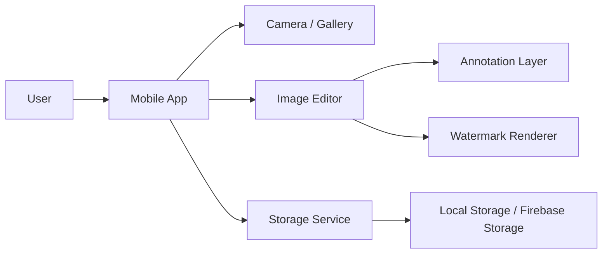

# Product Requirements Document
# App: Quick Mark

## 1. Overview

Quick Mark là một ứng dụng di động cho phép người dùng chụp ảnh hoặc chọn ảnh từ thư viện, đánh dấu các khu vực cần chú ý trên ảnh, thêm ghi chú nhanh, và lưu lại ảnh đã được chú thích kèm watermark của ứng dụng.

Mục tiêu của sản phẩm là cung cấp một trải nghiệm rất ngắn và trực quan để người dùng có thể chuyển từ “chụp ảnh” sang “ảnh có chú thích sẵn” mà không cần dùng các công cụ chỉnh sửa ảnh truyền thống.

---

## 2. Problem Statement

Trong nhiều tình huống thực tế, người dùng cần ghi chú nhanh trên ảnh để:
- báo cáo tình trạng vật thể hoặc sự cố
- chỉ ra vị trí cần kiểm tra
- gửi thông tin bằng hình ảnh cho người khác
- lưu lại tài liệu hoặc tình trạng hiện tại

Tuy nhiên, các công cụ chỉnh sửa ảnh hiện nay thường quá phức tạp, mất thời gian và không phù hợp cho thao tác nhanh. Quick Mark giải quyết vấn đề bằng cách tập trung vào một quy trình đơn giản: chụp ảnh → đánh dấu → ghi chú → lưu/share.

---

## 3. Product Goal

### Primary goal
Xây dựng một ứng dụng MVP cho phép người dùng:
- chụp ảnh hoặc chọn ảnh từ thư viện
- đánh dấu một điểm hoặc một vùng trên ảnh
- thêm ghi chú ngắn
- lưu ảnh đã có chú thích
- thêm watermark
- chia sẻ ảnh kết quả

### Business goal
- tạo ra một sản phẩm có giá trị ngay từ bản đầu
- đủ đơn giản để người dùng dùng hàng ngày
- tạo nền tảng cho các tính năng nâng cao sau này như AI nhận diện vật thể, cloud sync, template note

---

## 4. MVP Definition

MVP (Minimum Viable Product) là phiên bản tối thiểu của sản phẩm chỉ giữ lại những tính năng cốt lõi nhất để người dùng có thể thực hiện đầy đủ một hành trình giá trị đầu tiên.

Đối với dự án này, MVP bao gồm:
1. Mở app
2. Chụp ảnh hoặc chọn ảnh từ thư viện
3. Đánh dấu điểm hoặc vùng trên ảnh
4. Thêm ghi chú text
5. Lưu ảnh đã chỉnh
6. Thêm watermark
7. Chia sẻ ảnh

Mọi tính năng vượt quá phạm vi này sẽ được xem là “không thuộc MVP” và chuyển sang giai đoạn sau.

---

## 5. Scope

### In Scope
- camera capture
- gallery picker
- image editor
- point annotation
- rectangle annotation
- text note
- edit/delete annotation
- save final image
- watermark overlay
- share image
- recent images history

### Out of Scope
- AI object detection
- automatic object selection
- advanced photo editing
- multi-user collaboration
- cloud sync across devices
- complex template system

---

## 6. User Journey

### Main flow
1. Mở app
2. Chọn chụp ảnh hoặc chọn ảnh từ thư viện
3. Vào màn hình chỉnh sửa ảnh
4. Chọn kiểu đánh dấu: điểm, khung, hoặc note
5. Đặt chú thích lên ảnh
6. Xem trước kết quả
7. Lưu ảnh có watermark
8. Chia sẻ ảnh

### Example use case
Người dùng chụp một chiếc điện thoại, chọn một vùng trên ảnh, thêm ghi chú “cần kiểm tra màn hình”, sau đó lưu ảnh và gửi cho đồng nghiệp.

---

## 7. Functional Requirements

### 7.1 Home Screen
Yêu cầu:
- hiển thị nút “Chụp ảnh”
- hiển thị nút “Chọn ảnh”
- hiển thị ảnh đã lưu gần đây
- có thể mở cài đặt

Chi tiết:
- màn hình phải mở nhanh
- các nút action phải rõ ràng và dễ chạm

---

### 7.2 Camera Capture
Yêu cầu:
- mở camera trực tiếp từ app
- chụp ảnh
- hỗ trợ bật/tắt flash
- hỗ trợ đổi camera trước/sau
- hiển thị preview sau khi chụp

---

### 7.3 Gallery Picker
Yêu cầu:
- cho phép chọn ảnh từ thư viện thiết bị
- hỗ trợ file ảnh phổ biến như JPG, PNG

---

### 7.4 Image Editor
Yêu cầu:
- hiển thị ảnh đầy đủ trong khung editor
- hỗ trợ zoom và pan
- cho phép tạo annotation mới
- cho trợ sửa/xóa annotation

Annotation types:
- point
- rectangle
- text note

---

### 7.5 Annotation Behavior
Point annotation:
- khi người dùng chạm vào ảnh, tạo một điểm đánh dấu
- người dùng nhập text note
- điểm có thể được di chuyển hoặc xóa

Rectangle annotation:
- người dùng kéo trên ảnh để tạo khung chọn vùng
- người dùng nhập chú thích cho khung
- khung có thể được chỉnh sửa hoặc xóa

Text note:
- người dùng có thể đặt note ở vị trí cụ thể trên ảnh
- note có thể edit và xóa

---

### 7.6 Save Image
Yêu cầu:
- tạo ảnh mới từ ảnh gốc + annotation + watermark
- lưu ảnh vào thư viện thiết bị
- lưu metadata như thời gian tạo, chú thích, loại annotation

---

### 7.7 Share Image
Yêu cầu:
- cho phép chia sẻ ảnh vừa lưu qua các app khác
- hỗ trợ mở share sheet hệ thống

---

### 7.8 Recent Images
Yêu cầu:
- hiển thị danh sách ảnh đã lưu gần đây
- cho phép mở lại ảnh trước đó

---

## 8. Non-Functional Requirements

### Performance
- camera mở trong thời gian hợp lý trên thiết bị thông thường
- thao tác annotation không gây lag nghiêm trọng
- rendering ảnh phải mượt

### Reliability
- app không crash khi người dùng thao tác liên tục
- xử lý lỗi khi ảnh không hợp lệ hoặc bị hỏng

### Usability
- người dùng mới có thể hiểu cách dùng trong vài giây
- số thao tác để tạo một note phải tối thiểu

### Security and Privacy
- chỉ lưu dữ liệu cần thiết
- không lưu thông tin nhạy cảm không cần thiết

### Maintainability
- code phải được tổ chức rõ ràng theo module
- logic UI và logic nghiệp vụ phải tách riêng

---

## 9. UX/UI Requirements

### Design principles
- đơn giản
- nhanh
- trực quan
- ít thao tác
- dễ học

### Visual direction
- màu nền nhẹ
- màu accent chính là xanh dương hoặc xanh teal
- annotation nên có màu nổi bật như đỏ hoặc vàng
- watermark dùng màu nhạt để không che mất nội dung chính

### Interaction guidelines
- thao tác chính dựa trên chạm màn hình
- nút chức năng phải đủ lớn để thao tác dễ dàng
- hiển thị trạng thái đang chọn tool rõ ràng

### Screen requirements
- Home: nút chụp ảnh và chọn ảnh, danh sách ảnh gần đây
- Camera: preview, chụp, flash, đổi camera
- Editor: ảnh lớn, toolbar, annotation layer, save button
- Preview: xem trước ảnh cuối cùng, save/share
- History: danh sách ảnh đã lưu

---

## 10. UI Flow Specification

### Screen 1 – Home
Components:
- header
- primary button: Capture photo
- secondary button: Choose from gallery
- recent images section
- settings icon

### Screen 2 – Camera
Components:
- camera preview
- capture button
- flash toggle
- switch camera button
- close button

### Screen 3 – Editor
Components:
- full image canvas
- toolbar with tools: point, rectangle, text
- action buttons: undo, delete, save
- annotation layer

### Screen 4 – Preview / Save
Components:
- final image preview
- watermark preview
- save to gallery button
- share button
- back to edit button

### Screen 5 – History
Components:
- image list
- thumbnail
- timestamp
- open/delete action

---

## 11. Data Model

### ImageAsset
- id
- userId
- originalPath
- processedPath
- createdAt
- updatedAt
- watermarkEnabled

### Annotation
- id
- imageId
- type
- x
- y
- width
- height
- text
- color
- createdAt

### Note
- id
- imageId
- content
- positionX
- positionY
- createdAt

---

## 12. Technical Architecture

### Recommended stack
- Mobile framework: Flutter
- Language: Dart
- State management: Riverpod
- Camera and image libraries:
  - camera
  - image_picker
  - image
  - path_provider
  - share_plus

### Backend (optional for MVP)
- Firebase Auth
- Firestore
- Firebase Storage
- Firebase Analytics

### System architecture

### Application layers
- Presentation layer: screens and widgets
- Domain layer: use cases for capture, edit, save, share
- Data layer: repositories for images and annotations

---

## 13. Rendering Approach

Annotation phải được lưu theo tỷ lệ ảnh gốc để đảm bảo không bị lệch khi người dùng zoom hoặc resize ảnh.

Flow:
1. lấy ảnh gốc
2. tạo annotation layer
3. render text note
4. chèn watermark
5. xuất ảnh kết quả

---

## 14. Delivery Plan

### Sprint 0 – Discovery and Setup
Objectives:
- finalize scope
- define MVP
- setup project structure
- create initial design system

Deliverables:
- project skeleton
- wireframes
- development environment ready

---

### Sprint 1 – Home, Camera, Gallery
Objectives:
- build home screen
- integrate camera
- integrate gallery picker
- display selected image

Deliverables:
- user can open app and choose an image source

---

### Sprint 2 – Image Editor Foundation
Objectives:
- build editor screen
- support zoom/pan
- implement point annotation
- implement rectangle annotation

Deliverables:
- user can annotate the image with basic shapes

---

### Sprint 3 – Text Notes and Edit/Delete
Objectives:
- add note input
- allow edit/delete of annotation
- improve annotation UI

Deliverables:
- full basic annotation workflow

---

### Sprint 4 – Save, Watermark, Share
Objectives:
- render final image
- add watermark
- save image to gallery
- share image

Deliverables:
- user can complete end-to-end workflow

---

### Sprint 5 – Testing and Polish
Objectives:
- fix bugs
- improve UX
- validate on real devices
- prepare beta build

Deliverables:
- stable MVP build ready for test

---

## 15. Definition of Done for MVP

MVP được xem là hoàn thành khi:
- người dùng có thể mở app
- có thể chụp ảnh hoặc chọn ảnh
- có thể đánh dấu điểm hoặc vùng
- có thể thêm ghi chú
- có thể lưu ảnh đã chỉnh
- ảnh có watermark
- có thể chia sẻ ảnh
- app chạy ổn trên thiết bị mục tiêu

---

## 16. Risks and Mitigations

| Risk | Impact | Mitigation |
| --- | --- | --- |
| Annotation lệch khi zoom | High | lưu tọa độ theo tỷ lệ ảnh gốc |
| Ảnh load chậm | Medium | resize ảnh trước khi render |
| Watermark che nội dung chính | Medium | đặt ở góc và dùng màu nhạt |
| UI quá phức tạp | High | giữ toolbar đơn giản và rõ ràng |

---

## 17. Recommended Next Step

Bước tiếp theo nên là:
1. chốt scope MVP
2. dựng wireframe chi tiết từng màn hình
3. bắt đầu Sprint 0
4. triển khai camera và home screen trước

Đây là nền tảng tốt nhất để chuyển từ ý tưởng sang một sản phẩm có thể phát triển thực tế.
