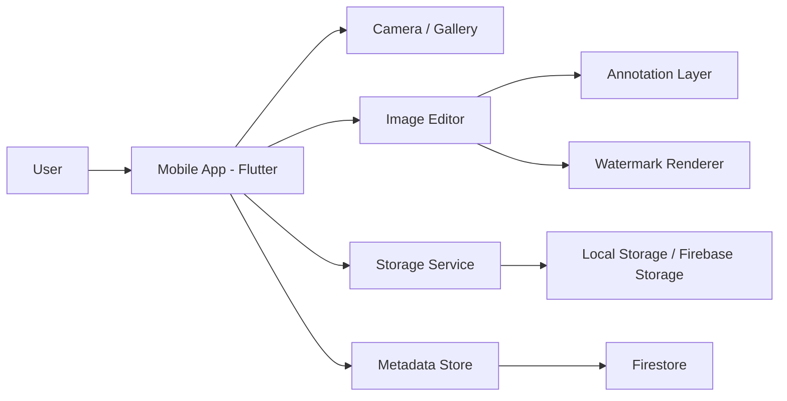
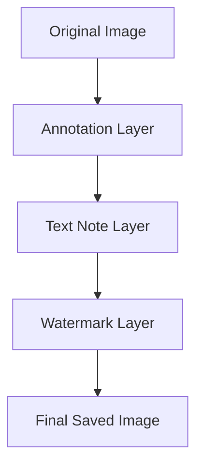

# Product Specification & Technical Blueprint
# App: Quick Mark / Snap Note

## 1. Document Purpose

Tài liệu này được thiết kế để phục vụ cho toàn bộ team phát triển app từ giai đoạn tư duy sản phẩm, thiết kế UX/UI, kỹ thuật, cho đến triển khai sprint và kiểm thử. Mục tiêu là tạo ra một bản tham chiếu thống nhất để team có thể hiểu rõ:
- vấn đề cần giải quyết
- phạm vi MVP
- yêu cầu chức năng và phi chức năng
- kiến trúc hệ thống
- quy trình triển khai
- kế hoạch sprint
- tiêu chuẩn hoàn thành

Status: Draft v1.0
Owner: Product + Engineering Team
Target Release: MVP Beta

---

## 2. Executive Summary

Ứng dụng cho phép người dùng chụp ảnh hoặc chọn ảnh từ thư viện, đánh dấu một vùng hoặc một vật thể trên ảnh, thêm ghi chú ngắn ngay trên ảnh, và lưu lại ảnh đã có chú thích với watermark của app. Mục tiêu là giúp người dùng không cần phải dùng các công cụ chỉnh sửa ảnh phức tạp trước khi lưu hoặc chia sẻ nội dung.

Core value proposition:
- chụp xong là có thể note ngay
- không cần thao tác phức tạp
- hình ảnh có thể dùng ngay cho báo cáo, trao đổi, kiểm tra, hoặc ghi nhận tình huống

---

## 3. Product Goal

### 3.1 Goal chính
Xây dựng một app di động MVP cho phép người dùng:
1. chụp ảnh hoặc chọn ảnh từ thư viện
2. chọn điểm hoặc vùng trên ảnh
3. nhập ghi chú nhanh
4. lưu ảnh đã được chú thích
5. thêm watermark
6. chia sẻ ảnh kết quả

### 3.2 Goal kinh doanh / sản phẩm
- tạo ra một trải nghiệm đơn giản, nhanh, và trực quan
- giải quyết nhu cầu ghi chú trên ảnh mà không cần edit ảnh chuyên nghiệp
- tạo nền tảng cho các phiên bản sau như AI nhận diện vật thể, template note, đồng bộ cloud, cộng tác nhóm

### 3.3 Success Metrics (MVP)
- người dùng hoàn thành 1 vòng chụp ảnh → note → lưu thành công
- thời gian trung bình để tạo 1 ảnh có chú thích dưới 1 phút
- tỷ lệ người dùng quay lại sử dụng app trong 7 ngày > 25%
- tỷ lệ lưu thành công không lỗi > 95%

---

## 4. Problem Statement

Người dùng thường có nhu cầu ghi chú nhanh trên hình ảnh trong tình huống thực tế như:
- chụp vật thể cần kiểm tra
- chụp hiện tượng cần báo cáo
- chụp đồ dùng cần chú ý
- chụp tài liệu và đánh dấu điểm cần lưu ý

Tuy nhiên, các công cụ chỉnh sửa ảnh phổ biến thường quá nặng và mất nhiều bước. Người dùng muốn một trải nghiệm rất ngắn: chụp → đánh dấu → ghi chú → lưu.

---

## 5. Target Users

### 5.1 Primary Users
- người dùng cá nhân
- nhân viên kỹ thuật / bảo trì / kiểm tra
- người bán hàng / tư vấn
- giáo viên / học sinh
- người dùng cần ghi chú trên ảnh hàng ngày

### 5.2 User Personas

#### Persona A – Người dùng nhanh, cần note linh hoạt
- thích thao tác đơn giản
- không muốn đọc hướng dẫn dài
- cần lưu lại ảnh ngay lập tức

#### Persona B – Người làm kiểm tra / bảo trì
- cần đánh dấu vị trí lỗi hoặc điểm cần chú ý
- cần ảnh có chú thích rõ ràng để gửi cho đồng nghiệp

#### Persona C – Người dùng nội dung / bán hàng
- muốn chụp sản phẩm và ghi chú cho khách hàng hoặc team

---

## 6. Scope

### 6.1 In Scope cho MVP
- mở camera
- chọn ảnh từ thư viện
- hiển thị ảnh trong editor
- chọn loại annotation:
  - điểm
  - khung chữ nhật
  - note text
- sửa và xóa annotation
- lưu ảnh đã chỉnh
- tự động chèn watermark
- chia sẻ ảnh
- xem lịch sử ảnh đã lưu

### 6.2 Out of Scope cho MVP
- nhận diện vật thể bằng AI
- nhận diện khuôn mặt / đối tượng tự động
- chỉnh sửa ảnh nâng cao như cắt, xoay nhiều lớp, filter phức tạp
- đồng bộ cloud đa thiết bị
- cộng tác nhiều người cùng chỉnh sửa
- phân quyền và quản lý nhóm

---

## 7. User Stories

### Core user stories
- As a user, I want to open the app and capture a photo quickly so that I can start annotating immediately.
- As a user, I want to choose an existing image from my gallery so that I can annotate it without taking a new photo.
- As a user, I want to tap on a point on the image and add a short note so that I can mark important areas.
- As a user, I want to draw a rectangle around an area so that I can highlight a specific section.
- As a user, I want to save the annotated image so that I can keep it for later.
- As a user, I want the final image to contain a watermark so that the source is clear.
- As a user, I want to share the final image so that I can send it to others easily.

---

## 8. Functional Requirements

## 8.1 Home Screen
### Requirements
- Hiển thị nút “Chụp ảnh” ở vị trí nổi bật
- Hiển thị nút “Chọn ảnh”
- Hiển thị danh sách ảnh gần đây
- Cho phép mở cài đặt

### Acceptance Criteria
- Người dùng mở app thấy màn hình chính trong vòng 2 giây
- Có thể nhấn vào nút chụp ảnh để mở camera
- Có thể chọn ảnh từ thư viện

---

## 8.2 Camera Capture
### Requirements
- Mở camera trực tiếp từ app
- Chụp ảnh
- Bật/tắt flash
- Đổi camera trước/sau
- Hiển thị preview sau khi chụp

### Acceptance Criteria
- Camera mở thành công trên thiết bị hỗ trợ
- Ảnh được lưu tạm thời sau khi chụp
- Người dùng có thể chọn lại ảnh nếu chưa hài lòng

---

## 8.3 Gallery Picker
### Requirements
- Cho phép người dùng chọn ảnh từ thư viện thiết bị
- Chấp nhận định dạng JPEG/PNG

### Acceptance Criteria
- Người dùng có thể mở thư viện và chọn 1 ảnh
- Ảnh được đưa vào editor đúng cách

---

## 8.4 Image Editor
### Requirements
- Hiển thị ảnh ở chế độ toàn màn hình hoặc gần toàn màn hình
- Cho phép zoom và pan
- Cho phép tạo annotation mới
- Cho phép sửa/xóa annotation

### Annotation Types
- Point annotation
- Rectangle annotation
- Text note

### Acceptance Criteria
- Annotation được tạo đúng vị trí trên ảnh
- Annotation vẫn đúng khi người dùng zoom
- Người dùng có thể xóa annotation vừa tạo

---

## 8.5 Annotation Behavior
### Point Annotation
- Khi người dùng chạm vào ảnh, tạo 1 marker tại vị trí đó
- Người dùng nhập nội dung note
- Marker có thể được di chuyển lại

### Rectangle Annotation
- Người dùng kéo trên ảnh để tạo khung hình chữ nhật
- Người dùng nhập nội dung note
- Khung có thể được chỉnh lại hoặc xóa

### Text Note
- Người dùng chạm vào vùng ảnh để đặt note
- Note có thể có màu khác nhau
- Nội dung có thể chỉnh lại

---

## 8.6 Save Image
### Requirements
- Tạo ảnh mới từ ảnh gốc + annotation + watermark
- Lưu ảnh vào thư viện thiết bị
- Lưu metadata (thời gian, note, annotation info)

### Acceptance Criteria
- Ảnh mới được lưu thành công
- File ảnh có thể mở lại từ thư viện
- Watermark xuất hiện trên ảnh kết quả

---

## 8.7 Share Image
### Requirements
- Cho phép chia sẻ ảnh đã lưu qua các ứng dụng có sẵn

### Acceptance Criteria
- Người dùng có thể chọn ứng dụng chia sẻ như Messenger, Zalo, Gmail, WhatsApp
- Ảnh được gửi đúng nội dung

---

## 8.8 History / Recent Images
### Requirements
- Hiển thị ảnh đã lưu gần đây
- Cho phép mở lại ảnh từ history

### Acceptance Criteria
- Danh sách ảnh hiển thị đúng thời gian và thumbnail
- Người dùng có thể mở lại ảnh trước đó

---

## 9. Non-Functional Requirements

### 9.1 Performance
- thời gian mở camera dưới 3 giây trên thiết bị thông thường
- thời gian xử lý annotation và render ảnh không làm giật UI

### 9.2 Reliability
- app không crash khi thao tác liên tục
- xử lý lỗi khi ảnh không hợp lệ hoặc bị hỏng

### 9.3 Usability
- thao tác chính không quá 3 bước để tạo 1 note
- giao diện phải dễ hiểu với người dùng mới

### 9.4 Security & Privacy
- không lưu thông tin nhạy cảm không cần thiết
- ảnh chỉ được lưu ở nơi cần thiết
- nếu có backend thì dữ liệu phải được bảo vệ

### 9.5 Maintainability
- code phải được tách module rõ ràng
- business logic và UI logic không chồng chéo

---

## 10. UX / UI Requirements

### 10.1 Design Principles
- đơn giản
- nhanh
- rõ ràng
- ít thao tác
- dễ học

### 10.2 Visual Style
- nền trắng hoặc xám nhạt
- màu chính xanh dương / teal
- màu chú ý đỏ hoặc vàng cho annotation
- watermark màu xám mờ, đặt ở góc

### 10.3 Interaction Style
- touch-first
- minimal text
- rõ nút action
- hiện tooltip hoặc hint khi cần

### 10.4 Screen Layout Requirements

#### Home Screen
- top bar: app name
- main actions: Camera, Gallery
- recent images section
- bottom navigation if needed

#### Editor Screen
- ảnh chiếm phần lớn không gian màn hình
- toolbar nằm ở dưới hoặc trên
- nút save nổi bật
- hiển thị annotation hiện tại ở layer riêng

#### Preview Screen
- preview ảnh cuối cùng
- nút Save / Share / Edit

---

## 11. Wireframe Specification

### Screen 1 – Home
Components:
- App header
- Hero button: Capture photo
- Secondary button: Choose from gallery
- Recent images card list
- Settings icon

### Screen 2 – Camera
Components:
- camera preview
- capture button
- flash toggle
- switch camera button
- close button

### Screen 3 – Editor
Components:
- image canvas
- annotation toolbar
- tool buttons: point, rectangle, text
- undo/redo
- delete selected annotation
- save button

### Screen 4 – Preview / Save
Components:
- final image preview
- watermark preview
- button Save to gallery
- button Share
- button Back to edit

### Screen 5 – History
Components:
- list of saved images
- thumbnail
- timestamp
- open / delete options

---

## 12. Data Model

### 12.1 Core Entities

#### User
- id
- displayName
- email
- createdAt

#### ImageAsset
- id
- userId
- originalPath
- processedPath
- createdAt
- updatedAt
- watermarkEnabled

#### Annotation
- id
- imageId
- type
- x
- y
- width
- height
- text
- color
- createdAt

#### Note
- id
- imageId
- content
- positionX
- positionY
- createdAt

---

## 13. Technical Architecture

## 13.1 Recommended Stack

### Mobile App
- Flutter
- Dart

### State Management
- Riverpod

### Image Handling
- camera
- image_picker
- image
- path_provider
- share_plus

### Backend (optional for MVP)
- Firebase Auth
- Firestore
- Firebase Storage
- Firebase Analytics

### Design Tool
- Figma

---

## 13.2 System Architecture Overview

### Component Responsibilities
- Camera / Gallery: capture new image or load existing image
- Image Editor: render and manage annotations
- Annotation Layer: store and render points, rectangles, notes
- Watermark Renderer: overlay app branding on final image
- Storage Service: save output image to device or cloud
- Metadata Store: save note/annotation data

---

## 14. Application Architecture Layers

### Presentation Layer
- HomeScreen
- CameraScreen
- EditorScreen
- PreviewScreen
- HistoryScreen
- SettingsScreen

### Domain Layer
- CaptureImageUseCase
- PickImageUseCase
- AddAnnotationUseCase
- SaveImageUseCase
- ShareImageUseCase

### Data Layer
- ImageRepository
- AnnotationRepository
- SettingsRepository

---

## 15. Rendering Strategy

### Image Coordinate Model
- annotation phải lưu theo tỷ lệ ảnh gốc
- khi render lại, app chuyển đổi sang kích thước hiện tại của widget
- điều này giúp annotation không bị lệch khi zoom hoặc resize

### Render Flow

---

## 16. Development Workflow

### Methodology
- Agile with Scrum-style sprints
- 1 sprint có thể kéo dài 1 tuần hoặc 2 tuần tùy team
- mỗi sprint có planning, daily standup, review, retrospective

### Git Workflow
- branch theo feature: feature/camera, feature/editor, feature/save
- merge thông qua pull request
- mỗi PR cần review và test tối thiểu

### Definition of Done
- code hoàn thành và chạy được
- unit test hoặc smoke test có kết quả tốt
- UI đúng theo spec
- không có lỗi nghiêm trọng
- đã được review

---

## 17. Sprint Plan

## Sprint 0 – Project Setup & Discovery
### Goal
- thống nhất scope và spec
- setup project
- tạo wireframe và design system cơ bản

### Deliverables
- project skeleton
- Figma wireframe
- folder structure
- environment setup

### Duration
- 3–5 ngày

---

## Sprint 1 – Home + Camera + Gallery
### Goal
- người dùng có thể mở app và chọn ảnh/chụp ảnh

### Deliverables
- Home screen
- Camera access
- Gallery access
- image preview

### Acceptance Criteria
- app mở được
- chụp ảnh thành công
- chọn ảnh từ thư viện thành công

---

## Sprint 2 – Image Editor Foundation
### Goal
- người dùng có thể thao tác trên ảnh

### Deliverables
- editor screen
- zoom/pan
- point annotation
- rectangle annotation

### Acceptance Criteria
- người dùng có thể đánh dấu trên ảnh
- annotation hiển thị đúng vị trí

---

## Sprint 3 – Text Notes + Edit/Delete
### Goal
- người dùng có thể thêm và quản lý ghi chú

### Deliverables
- text note input
- edit/delete annotation
- note color and style options

### Acceptance Criteria
- người dùng có thể nhập note và lưu lại
- có thể sửa/xóa note

---

## Sprint 4 – Save + Watermark + Share
### Goal
- tạo ảnh hoàn chỉnh và có thể chia sẻ

### Deliverables
- render final image
- watermark overlay
- save to gallery
- share feature

### Acceptance Criteria
- ảnh lưu thành công
- watermark xuất hiện
- share hoạt động

---

## Sprint 5 – History + Polish + Testing
### Goal
- cải thiện trải nghiệm và độ ổn định

### Deliverables
- recent images screen
- bug fixing
- performance optimization
- UX refinement

### Acceptance Criteria
- app chạy ổn trên device test
- không có lỗi nghiêm trọng trong flow chính

---

## Sprint 6 – Beta Release
### Goal
- release bản beta cho người dùng thử

### Deliverables
- production build
- internal testing
- feedback collection

### Acceptance Criteria
- app có thể cài và chạy trên target devices
- flow chính có thể hoàn thành thành công

---

## 18. Team Structure

### Product
- xác định scope và ưu tiên feature
- duy trì backlog và requirement clarity

### Designer
- thiết kế UI/UX
- tạo component system và screen flow

### Mobile Engineer
- xây dựng UI và logic app
- implement camera/editor/save/share

### Backend Engineer (optional)
- thiết kế storage và metadata sync nếu cần

### QA
- test flow chính
- test trên nhiều thiết bị
- report bug

---

## 19. Implementation Priorities

### Priority 1 – Must Have
- capture image
- import from gallery
- edit image
- add point/rectangle/text note
- save final image
- watermark
- share

### Priority 2 – Should Have
- history screen
- delete/edit annotation
- improved styling
- better preview

### Priority 3 – Nice to Have
- AI object detection
- cloud sync
- collaboration
- templates

---

## 20. Risks & Mitigations

| Risk | Impact | Mitigation |
| --- | --- | --- |
| Annotation bị lệch khi zoom | Cao | lưu tọa độ theo tỷ lệ ảnh gốc |
| Load ảnh chậm | Trung bình | resize ảnh trước khi xử lý |
| Watermark làm ảnh bị che khuất | Trung bình | đặt ở góc, màu nhạt |
| UI quá phức tạp | Cao | giữ toolbar tối giản và trực quan |
| Thiết bị khác nhau có camera khác nhau | Trung bình | test trên nhiều device và fallback logic |

---

## 21. Open Questions

- Có cần đăng nhập hay sử dụng anonymous mode trong MVP không?
- Có cần lưu ảnh lên cloud không?
- Watermark có tùy chỉnh màu/logo không?
- Có cần hỗ trợ video annotation không?
- Có cần hỗ trợ nhiều loại note như checklist không?

---

## 22. Recommended MVP Release Criteria

App MVP được xem là hoàn thành khi:
- người dùng có thể chụp ảnh hoặc chọn ảnh
- có thể đánh dấu và ghi chú trên ảnh
- lưu được ảnh đã chỉnh
- ảnh có watermark
- có thể chia sẻ ảnh
- app chạy ổn trên thiết bị mục tiêu

---

## 23. Final Recommendation

Để phát triển thành công, team nên tập trung vào 1 MVP cực kỳ rõ ràng:
- chụp ảnh
- chọn ảnh
- đánh dấu điểm / vùng
- nhập note
- lưu ảnh và watermark
- share ảnh

Đây là phần giá trị cốt lõi của sản phẩm. Sau khi MVP ổn định, team có thể mở rộng sang AI, cloud sync và cộng tác nhóm.
