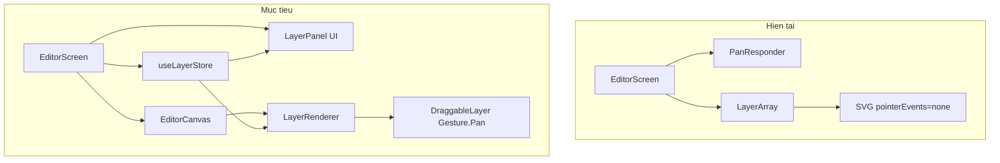
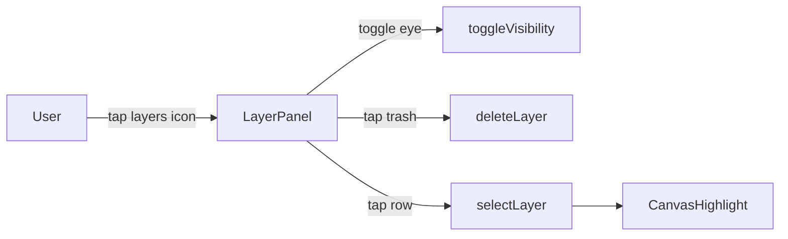

# Nâng cấp Layer Manager & Drag-n-Drop cho Quick Mark

## Hiện trạng (Code Review)

Logic chính nằm trong [`app/editor.tsx`](typescript-node/projects/artifacts/quick-mark/app/editor.tsx) — một file monolithic ~328 dòng. Hệ thống Layer **đã có nền tảng** nhưng **chưa có UI hay gesture tương tác**:

```38:44:typescript-node/projects/artifacts/quick-mark/app/editor.tsx
interface Layer {
  id: string;
  type: LayerType;
  data: any;
  visible: boolean;
  zIndex: number;
}
```

| Khả năng | Trạng thái |
|---|---|
| Tạo layer (stroke/box/sticker) | Hoạt động |
| `visible` flag | Có trong model, **không có UI toggle** |
| `zIndex` | Gán khi tạo, **không sort, không reorder** |
| Xóa layer cụ thể | Chỉ có "xóa nét cuối" (`slice(0,-1)`) |
| Drag sticker/box | **Chưa có** — sticker luôn spawn tại `(0.5, 0.5)` |
| Gesture Handler | Đã cài (`~2.28`) + Reanimated (`~4.1`), **chưa dùng cho drag** |
| `features/editor/` | Skeleton rỗng — [`EditorCanvas.tsx`](typescript-node/projects/artifacts/quick-mark/features/editor/components/EditorCanvas.tsx) chỉ render Image |
| Dead code | State `stickers` (L105) không dùng |

**Vấn đề kỹ thuật chính:**

1. SVG overlay đặt `pointerEvents="none"` → không thể chạm/chọn layer
2. `PanResponder` chỉ active khi `tool === 'markup'` → không thể kéo object
3. `Pressable` bọc canvas (compare mode) có thể xung đột gesture
4. Layers render theo thứ tự mảng, không theo `zIndex`



---

## Kiến trúc đề xuất

Tách từ `editor.tsx` sang `features/editor/` — giữ UI toolbar/panels ở screen, đưa logic layer + canvas vào feature module:

```
features/editor/
├── types.ts                    # Layer, LayerType, StickerData, BoxData...
├── hooks/
│   └── useLayers.ts            # wrap useHistory + layer CRUD
├── utils/
│   └── layerHitTest.ts         # hit test normalized coords
└── components/
    ├── LayerPanel.tsx          # Bảng điều khiển layer
    ├── LayerRenderer.tsx       # render từng layer type
    ├── DraggableLayer.tsx      # Gesture.Pan wrapper
    └── EditorCanvas.tsx        # canvas + image + overlays
```

---

## Phase 1: Layer Store & Types

**File mới:** `features/editor/types.ts`

- Định nghĩa typed `data` thay vì `any`:
  - `StrokeData`, `BoxData`, `StickerData` (x, y normalized 0–1)
- Thêm `selectedLayerId: string | null` vào editor state

**File mới:** `features/editor/hooks/useLayers.ts`

Wrap [`lib/historyManager.ts`](typescript-node/projects/artifacts/quick-mark/lib/historyManager.ts) với các action:

- `toggleVisibility(id)` — flip `layer.visible`
- `deleteLayer(id)` — xóa layer cụ thể (thay `eraseLastMark`)
- `selectLayer(id | null)`
- `updateLayerData(id, partial)` — cập nhật vị trí sau drag
- `bringToFront(id)` — set `zIndex = max + 1`
- `sortedLayers` — `useMemo` sort theo `zIndex` asc

Tất cả mutation đi qua `setState` của `useHistory` để undo/redo tự động hoạt động.

---

## Phase 2: Layer Manager UI

**File mới:** `features/editor/components/LayerPanel.tsx`

Bảng điều khiển nhỏ, style khớp `BlurView` + dark editor chrome hiện có:

- **Trigger:** Icon `layers-outline` trên title row (cạnh undo/redo)
- **Layout:** Bottom sheet nhỏ (~180px) slide up từ trên bottom dock, dùng `Animated` + `BlurView`
- **Mỗi row layer** (hiển thị từ trên xuống — layer trên cùng trước):
  - Icon theo type: `pencil` / `square` / `happy`
  - Label: "Nét vẽ #3", "Khung blur", emoji sticker
  - Nút **ẩn/hiện** (`eye` / `eye-off`) → `toggleVisibility`
  - Nút **xóa** (`trash`) → `deleteLayer` + haptic
  - Tap row → `selectLayer(id)` + highlight trên canvas
- **Empty state:** "Chưa có lớp nào"
- **Badge:** Số layer trên icon trigger



---

## Phase 3: Drag-n-Drop với Gesture Handler

**File mới:** `features/editor/components/DraggableLayer.tsx`

Dùng API hiện đại của RNGH v2 + Reanimated 4:

```tsx
const pan = Gesture.Pan()
  .enabled(isDraggable && !isComparing)
  .onUpdate(e => { translateX.value = startX + e.translationX; ... })
  .onEnd(() => {
    runOnJS(commitPosition)(normalizedX, normalizedY);
  });
```

**Quy tắc kéo thả:**

| Layer type | Có thể kéo? | Điều kiện |
|---|---|---|
| `sticker` | Có | Luôn khi tool = `sticker` hoặc layer được chọn |
| `box` | Có | Khi layer được chọn (từ LayerPanel hoặc tap) |
| `stroke` | Không (v1) | Pen path không có bounding box ổn định |

**Hit testing:** `features/editor/utils/layerHitTest.ts`

- Duyệt `sortedLayers` **ngược** (top-first)
- Sticker: distance từ touch đến `(x,y)` < threshold (~40px)
- Box: point-in-rect check trên normalized coords
- Tap canvas (không hit layer) → `selectLayer(null)`

**Tách gesture zones trong `EditorCanvas.tsx`:**

- **Markup mode** (`tool === 'markup'`): giữ `PanResponder` cho vẽ pen/rectangle — như hiện tại
- **Sticker/select mode**: `GestureDetector` trên từng `DraggableLayer`, không dùng PanResponder canvas
- Bỏ `pointerEvents="none"` khỏi SVG; thay bằng `pointerEvents="box-none"` trên container, `auto` trên draggable items

**Selection highlight:** Viền dashed `#FFD60A` (selection dot color hiện có) quanh layer được chọn — render bằng `Rect` SVG hoặc `Animated.View` overlay.

**Commit sau drag:** Gọi `updateLayerData(id, { x, y })` → lưu vào history → auto-save draft.

---

## Phase 4: Polish "xịn" (Smart UX)

Những cải tiến nhỏ nhưng tạo cảm giác premium:

1. **Haptic feedback** — `selectionAsync` khi chọn layer, `impactLight` khi drop (đã có pattern trong editor)
2. **Bring-to-front on select** — layer được chọn/chạm tự lên trên
3. **Animate panel** — `FadeInDown`/`SlideInUp` cho LayerPanel (reuse pattern `ToolPanel`)
4. **Sticker spawn thông minh** — thêm sticker tại vị trí tap gần nhất thay vì luôn `(0.5, 0.5)`; offset mỗi sticker mới để không chồng
5. **Xóa dead code** — bỏ state `stickers` không dùng (L105)
6. **Sort render** — `layers.sort((a,b) => a.zIndex - b.zIndex)` trước khi map

---

## Thay đổi file cụ thể

| File | Hành động |
|---|---|
| [`app/editor.tsx`](typescript-node/projects/artifacts/quick-mark/app/editor.tsx) | Refactor: import hooks/components, giảm ~40% dòng |
| `features/editor/types.ts` | **Tạo mới** |
| `features/editor/hooks/useLayers.ts` | **Tạo mới** |
| `features/editor/utils/layerHitTest.ts` | **Tạo mới** |
| `features/editor/components/LayerPanel.tsx` | **Tạo mới** |
| `features/editor/components/DraggableLayer.tsx` | **Tạo mới** |
| `features/editor/components/LayerRenderer.tsx` | **Tạo mới** — tách `MemoizedPath`, `MemoizedBox`, sticker |
| `features/editor/components/EditorCanvas.tsx` | **Viết lại** — tích hợp canvas, gestures, layers |

Không cần thêm dependency — `react-native-gesture-handler`, `react-native-reanimated`, `expo-blur`, `expo-haptics` đã có sẵn.

---

## Rủi ro & giải pháp

- **Gesture conflict (PanResponder vs Gesture.Pan):** Chỉ mount PanResponder khi `tool === 'markup'`; draggable layers dùng RNGH riêng. Compare-mode `Pressable` giữ `pointerEvents` phù hợp.
- **Performance khi drag:** Dùng `useSharedValue` + `useAnimatedStyle` — không re-render toàn bộ layers mỗi frame; chỉ `runOnJS` commit ở `onEnd`.
- **Undo/redo sau drag:** Mỗi drop = 1 history entry (debounce nếu cần, nhưng 1 entry/drop là UX chuẩn).
- **Web compatibility:** RNGH hoạt động trên web qua Expo; test trên `dev:localhost` + `w`.

---

## Test plan

1. Thêm 3 layer (pen, box, sticker) → LayerPanel hiển thị đúng 3 row
2. Toggle ẩn → layer biến mất trên canvas, vẫn còn trong panel
3. Xóa layer giữa → layer biến mất, undo khôi phục
4. Kéo sticker → vị trí mới persist sau release, undo hoạt động
5. Chọn box từ panel → kéo reposition
6. Markup pen mode → vẽ vẫn hoạt động, không trigger drag
7. Compare (long press) → drag bị disable
8. Save/export → layers visible được capture đúng
